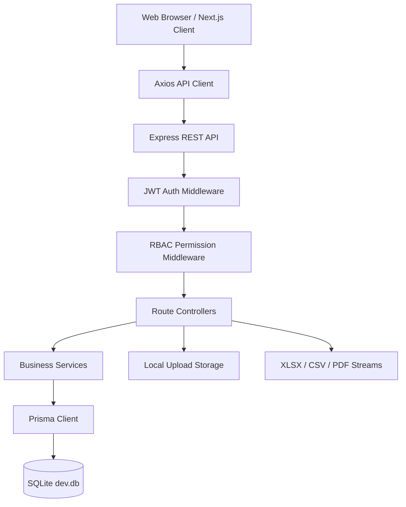
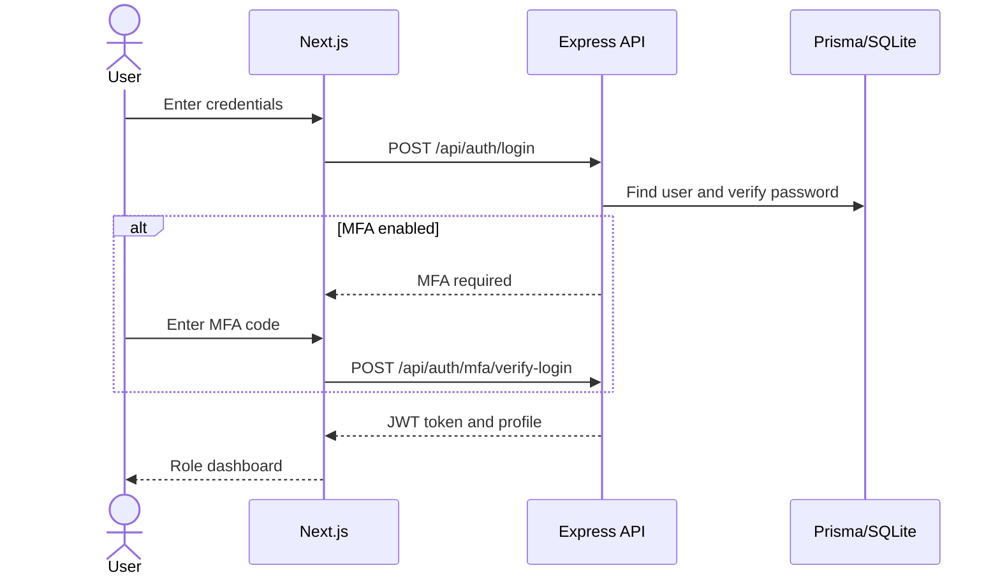
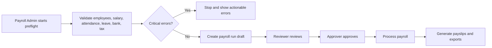
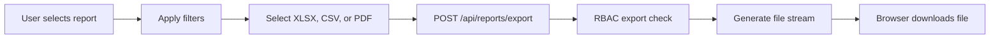

# 02. Technical Requirements Document (TRD) - PID hcms

## 1. Document Control

| Item | Details |
| --- | --- |
| Application | PID hcms |
| Document Type | Technical Requirements Document |
| Primary Audience | Fullstack developers, QA engineers, DevOps, security reviewers, implementation partners |
| Current Local Platform | Web application with backend API and optional Flutter mobile app code |
| Current Local Database | SQLite through Prisma ORM |
| API Base URL | `http://localhost:5000/api` |
| Web URL | `http://localhost:3000` |
| Health Check | `http://localhost:5000/health` |

## 2. Technology Stack

### Frontend

| Layer | Technology | Current Usage |
| --- | --- | --- |
| Framework | Next.js 15 | App Router pages under `frontend/src/app` |
| UI Library | React 19 | Role dashboards, forms, reports, HRMS screens |
| Language | TypeScript | Frontend application code and API helpers |
| HTTP Client | Axios | Central API client in `frontend/src/lib/api.ts` |
| Charts | Recharts | Dashboards and analytics visualizations |
| Styling | Global CSS | `frontend/src/app/globals.css` and component-level styling |
| Runtime Config | `.env.local` | `NEXT_PUBLIC_API_URL=http://localhost:5000/api` |

### Backend

| Layer | Technology | Current Usage |
| --- | --- | --- |
| Runtime | Node.js >= 20 | Backend process and scripts |
| API Framework | Express 5 | REST API, middleware, route controllers |
| ORM | Prisma 6 | Database models and generated client |
| Database | SQLite locally | `backend/prisma/dev.db` via `DATABASE_URL=file:./dev.db` |
| Authentication | JWT | Cookie/header based authentication |
| Password Hashing | bcryptjs | User password hashing |
| Validation | Zod and controller validation | Request validation and business checks |
| File Uploads | multer | Documents, photos, resumes, receipts |
| Email | nodemailer | Payslip and notification delivery support |
| Reports | exceljs, pdfkit | XLSX, CSV, and PDF report generation |
| Dates | date-fns, date-fns-tz | Payroll, attendance, timezone calculations |
| Testing | Jest, Supertest | API and integration tests |

### Mobile

| Layer | Technology | Current Usage |
| --- | --- | --- |
| Framework | Flutter |
| Language | Dart |
| Packages | `http`, `shared_preferences`, `intl` |
| Purpose | Mobile Employee Self Service portal codebase under `mobile_app` |

## 3. Repository Structure

```text
HRMS_application/
  backend/
    prisma/
      schema.prisma
      seed.js
      dev.db
    src/
      controllers/
      middleware/
      rbac/
      routes/
      services/
      index.js
    __tests__/
    package.json
    .env
  frontend/
    src/
      app/
      lib/
    package.json
    .env.local
  mobile_app/
    lib/
    pubspec.yaml
  docs/
    02_TRD_Technical_Requirements.md
    HRMS_Production_E2E_Test_Strategy.md
```

## 4. High-Level Architecture

PID hcms is implemented as a three-tier HRMS system.



### Architectural Principles

- The frontend is responsible for user workflows, role dashboards, forms, report screens, and clear user-facing messages.
- The backend owns authentication, authorization, business rules, payroll calculations, report generation, file validation, and data persistence.
- Prisma is the single database access layer.
- Protected files are not served as public static files; downloads must go through authenticated APIs.
- RBAC is enforced on the server side, not only through sidebar visibility.
- Reports and exports are permission-gated through `REPORTS.EXPORT`, payroll permissions, or compliance permissions as applicable.

## 5. Runtime Configuration

### Backend `.env`

```env
DATABASE_URL="file:./dev.db"
JWT_SECRET="supersecretjwtkey"
JWT_EXPIRES_IN="7d"
PORT=5000
```

Optional production-style variables to add when integrations are enabled:

```env
NODE_ENV=production
ALLOWED_ORIGINS=https://your-hrms-domain.example
SMTP_HOST=
SMTP_PORT=587
SMTP_USER=
SMTP_PASS=
SMTP_FROM=
```

### Frontend `.env.local`

```env
NEXT_PUBLIC_API_URL=http://localhost:5000/api
```

## 6. Backend API Modules

The backend mounts the following API modules from `backend/src/index.js`.

| Module | Base Route | Primary Responsibility |
| --- | --- | --- |
| Authentication | `/api/auth` | Login, signup, profile, password, MFA |
| Permissions | `/api/permissions` | Role and user permissions |
| Employees | `/api/employees` | Employee master, departments, profile tabs, org chart |
| Documents | `/api/documents` | Employee document upload/download/delete |
| Attendance | `/api/attendance` | Check-in/out, manual mark, monthly report, biometric sync |
| Leave | `/api/leave` | Leave request, approval, balances, calendar |
| Payroll | `/api/payroll` | Salary structure, preflight, payroll run, review, approval, export |
| Payslip | `/api/payslip` | Payslip history, PDF download, bulk payslips, email |
| Projects | `/api/projects` | Project CRUD, task CRUD, project expenses |
| Timesheet | `/api/timesheet` | Daily time logging and summaries |
| Overtime | `/api/overtime` | Overtime detection, approval, rejection |
| Utilization | `/api/utilization` | Resource utilization dashboards |
| Recruitment | `/api/recruitment` | Jobs, applicants, interviews, offers |
| Performance | `/api/performance` | KRA, appraisals, feedback |
| Expenses | `/api/expenses` | Claims, receipts, travel advances, approvals |
| Shifts | `/api/shifts` | Shift types, assignments, shift audit |
| Regularizations | `/api/regularizations` | Attendance correction requests |
| Checklists | `/api/checklists` | Onboarding and offboarding task templates |
| Dashboard | `/api/dashboard` | Executive and personalized role dashboards |
| Tax | `/api/tax` | Declarations, TDS, previous employer income |
| Compliance | `/api/compliance` | PF ECR, ESIC, Form 16 |
| FNF | `/api/fnf` | Full and final settlement |
| Reports | `/api/reports` | Dynamic reports, exports, audit report center |
| Assets | `/api/assets` | Asset inventory, assignment, return |
| Learning | `/api/learning` | Courses and enrollments |
| Helpdesk | `/api/helpdesk` | Tickets and resolutions |
| Notifications | `/api/notifications` | Notification inbox and read status |
| Platform | `/api/platform` | Tenant organization, policies, workflows, integrations |
| Billing | `/api/billing` | Plans, subscriptions, checkout, payment confirmation |
| Contact | `/api/contact` | Public contact request and admin listing |
| Platform Admin | `/api/platform-admin` | SaaS company, KYC, subscription, metrics |
| AI Helpers | `/api/ai` | Advisory helpers for audit, payroll, attendance, policy Q&A |

## 7. Key Technical Requirements

### Authentication

- Users authenticate with email and password.
- Passwords must be hashed with bcrypt before persistence.
- JWT sessions must honor `JWT_EXPIRES_IN`.
- The backend must support cookie/header based JWT authentication.
- MFA flows must prevent access until login verification is completed.
- Inactive users must be blocked from protected APIs.

### Authorization and RBAC

- Every protected route must use authentication middleware.
- Sensitive modules must use RBAC middleware or role checks.
- Role permissions support actions: `VIEW`, `CREATE`, `EDIT`, `DELETE`, `EXPORT`.
- Server-side checks must protect direct API calls even when UI navigation is hidden.
- Data scope must be enforced:
  - Employees see own records.
  - Managers see self and reporting hierarchy.
  - Tenant admins see own company data.
  - Platform admin routes are limited to platform roles.

### Data and Persistence

- Prisma schema is the canonical data model.
- Local development uses SQLite.
- Production should use a managed relational database such as PostgreSQL after provider migration and testing.
- Employee ID must be unique within company scope.
- User email must be unique globally.
- Payroll, attendance, leave, audit, and report data must preserve historical records.

### File Handling

- Upload APIs must validate file type, file size, and ownership.
- Uploaded files must be downloaded through authenticated endpoints.
- HR documents, payslips, receipts, resumes, and offer letters must not be public URLs.
- Production should use private object storage with signed download URLs.

### Reporting and Audit

- General reports must support export to Excel, CSV, and PDF where implemented through `/api/reports/export`.
- Audit Report Center exports audit packs through `/api/reports/audit/export`.
- Report access must require `REPORTS.VIEW`.
- Export actions must require `REPORTS.EXPORT` or the module-specific export permission.
- Salary, bank, statutory, and personal data must be masked or restricted for unauthorized users.

### User Messages

- Frontend API success and error messages must be short, unique, layman-friendly, and action-oriented.
- The central message catalog is `frontend/src/lib/userMessages.ts`.
- Legacy browser alerts are converted into toast messages by `frontend/src/lib/toastContext.tsx`.

## 8. Core Workflows

### Login



### Payroll Run



### Report Export



## 9. Frontend Pages

| Area | Main Pages |
| --- | --- |
| Public | `/`, `/features`, `/pricing`, `/contact`, `/privacy`, `/terms`, `/signup`, `/login` |
| Dashboards | `/dashboard`, `/dashboard/admin`, `/dashboard/employee`, `/dashboard/manager`, `/dashboard/admin/reports` |
| HR Core | `/employees`, `/employees/[id]`, `/org-chart`, `/permissions`, `/platform`, `/platform-admin`, `/kyc` |
| Attendance and Leave | `/attendance`, `/leave`, `/shifts`, `/overtime`, `/timesheet` |
| Payroll and Compliance | `/payroll`, `/payslips`, `/dashboard/admin/reports` |
| Talent | `/recruitment`, `/recruitment/jobs/[id]`, `/recruitment/interviews`, `/performance`, `/performance/appraisals` |
| Operations | `/projects`, `/dashboard/project/[id]`, `/expenses`, `/expenses/approvals`, `/assets`, `/learning`, `/helpdesk`, `/notifications`, `/checklists` |
| Billing and AI | `/checkout`, `/dashboard/billing`, `/dashboard/ai-agents` |

## 10. Database Requirements

### Major Model Groups

- Identity: `User`, `Permission`
- Organization: `Company`, `Department`, `LegalEntity`, `Branch`, `Location`
- Employee master: `Employee`, address, education, experience, dependents, bank, PF, exit, salary revision
- Attendance: attendance records, settings, biometric devices, shifts, regularization
- Leave: leave requests and quotas
- Payroll: payroll settings, salary structures, runs, records, payslips, tax declarations, TDS ledger
- Recruitment: jobs, applicants, interviews, offers
- Projects: projects, resources, tasks, timesheets, overtime, project expenses
- Finance: expense claims, travel advances
- HR operations: assets, learning, helpdesk, notifications, checklists
- Reports and governance: audit logs, compliance obligations, subscriptions, payments

### Data Integrity Rules

- Do not hard-delete business records that are required for payroll, audit, or compliance history.
- Use soft status flags such as `isActive` where lifecycle history matters.
- Prevent duplicate employee codes per company.
- Prevent duplicate user emails.
- Preserve payroll run and payslip history after processing.
- Reject report filters that are not allowed fields.

## 11. Security Requirements

- Use HTTPS in non-local deployments.
- Set strict CORS origins through `ALLOWED_ORIGINS`.
- Keep `JWT_SECRET` outside source control in real deployments.
- Enable secure cookie flags in production.
- Validate all file uploads by extension and MIME type.
- Reject script/executable uploads.
- Protect against IDOR/BOLA on employee, document, payslip, claim, task, and report IDs.
- Apply server-side RBAC to all protected APIs.
- Add audit logs for sensitive write operations.
- Restrict salary, PAN, Aadhaar, bank, tax, and payroll exports.
- Use private object storage for production files.

## 12. Performance Requirements

Suggested release targets:

| Area | Benchmark |
| --- | --- |
| Login/profile API | p95 under 500 ms at 100 concurrent users |
| Dashboard | p95 under 2 seconds for 5,000 employees |
| Employee search | p95 under 1 second for 50,000 employees |
| Payroll preflight | 5,000 employees under 2 minutes |
| Payroll run | 5,000 employees under 5 minutes |
| Report export | 100,000 rows under 2 minutes or async job |
| Biometric sync | 100,000 punches under 10 minutes |
| File upload | 10 MB file within agreed timeout |

## 13. Testing Requirements

### Backend

- Run all backend tests with `npm test`.
- Use Supertest for route-level integration tests.
- Cover auth, RBAC, employee, attendance, leave, payroll, reports, export, and audit center.
- Add data-driven tests for payroll and statutory calculations.

### Frontend

- Run production build with `npm run build`.
- Add UI smoke tests for login, dashboard, employee CRUD, leave, attendance, payroll, reports, and export.
- Add role-based navigation checks.

### Release Gate

- Backend tests pass.
- Frontend build passes.
- Critical E2E workflows pass.
- RBAC and IDOR tests pass.
- Payroll sample values are signed off.
- Report exports open correctly in XLSX, CSV, and PDF formats.

## 14. Local Development Guide

### Prerequisites

- Node.js 20 or later.
- npm.
- Git.
- Optional: Flutter SDK 3.x for `mobile_app`.

### Backend Setup

```powershell
cd e:\HRMS_application\backend
npm install
npm run prisma:generate
npm run prisma:push
npm run seed
npm run dev
```

Backend runs at:

```text
http://localhost:5000
http://localhost:5000/health
```

### Frontend Setup

Open a second terminal:

```powershell
cd e:\HRMS_application\frontend
npm install
npm run dev
```

Frontend runs at:

```text
http://localhost:3000
```

### Optional Mobile Setup

```powershell
cd e:\HRMS_application\mobile_app
flutter pub get
flutter run
```

## 15. Seed Login Credentials

After running `npm run seed` in the backend:

| Role | Email | Password |
| --- | --- | --- |
| Super Admin | `superadmin@hrms.com` | `admin123` |
| Admin | `admin@hrms.com` | `admin123` |
| Manager | `manager@hrms.com` | `admin123` |
| Employee sample | `rajesh.kumar@company.com` | `employee123` |
| Employee sample | `priya.sharma@company.com` | `employee123` |

## 16. Common Development Commands

### Backend

```powershell
npm run dev              # Start backend in watch mode
npm start                # Start backend normally
npm run prisma:generate  # Generate Prisma client
npm run prisma:push      # Apply schema to SQLite database
npm run seed             # Reset and seed local data
npm test                 # Run Jest tests
npx prisma studio --schema=prisma/schema.prisma
```

### Frontend

```powershell
npm run dev      # Start Next.js dev server
npm run build    # Production build validation
npm start        # Start production build after npm run build
```

## 17. Troubleshooting

### Port 5000 or 3000 Is Already In Use

```powershell
Get-NetTCPConnection -LocalPort 5000 -ErrorAction SilentlyContinue
Get-NetTCPConnection -LocalPort 3000 -ErrorAction SilentlyContinue
Stop-Process -Id <PID> -Force
```

### Prisma Client Is Out of Date

```powershell
cd e:\HRMS_application\backend
npm run prisma:generate
npm run prisma:push
```

### Reset Local Test Data

```powershell
cd e:\HRMS_application\backend
npm run seed
```

### Frontend Cannot Reach Backend

Check:

- Backend is running on port `5000`.
- `frontend/.env.local` contains `NEXT_PUBLIC_API_URL=http://localhost:5000/api`.
- Browser can open `http://localhost:5000/health`.

## 18. Production Recommendations

- Move from SQLite to PostgreSQL before production.
- Store uploaded files in private object storage such as S3, Azure Blob, or GCS.
- Use managed secrets for JWT and SMTP credentials.
- Enable centralized logging and monitoring.
- Add background jobs for heavy payroll, biometric sync, and large report exports.
- Add database backups and restore drills.
- Add CI/CD gates for lint, build, tests, security scans, and smoke tests.
- Use production-grade email, SMS, biometric, bank file, and accounting integrations only through sandbox-tested adapters.
