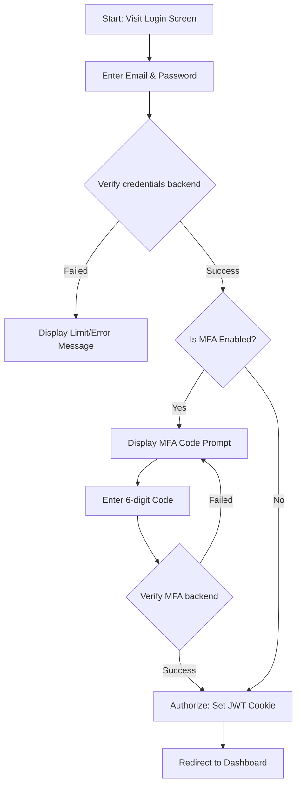
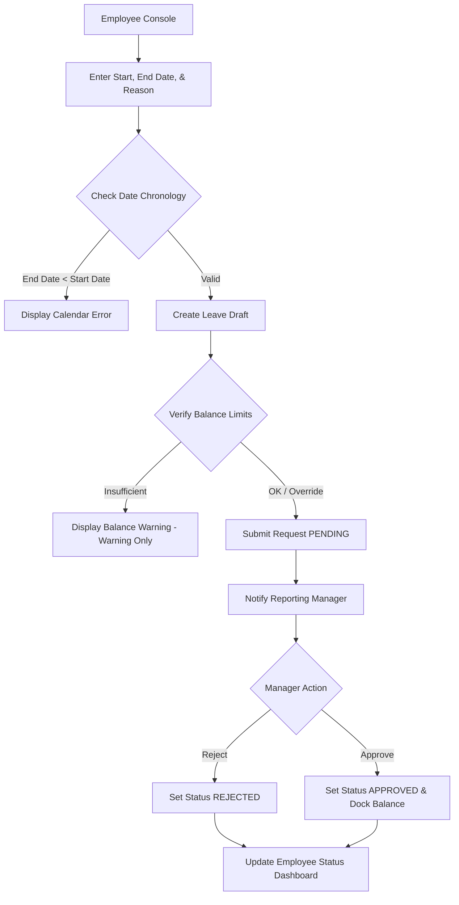
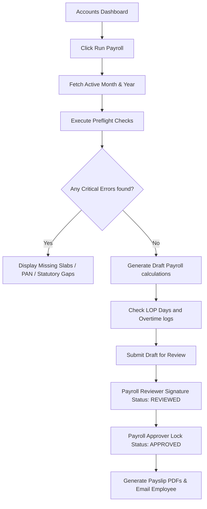

# 03. Screen List, App Flow, and Navigation Document

## 1. Screen Inventory

This document details all client-side pages and components discovered in the Next.js `frontend/src/app` codebase.

| Screen ID | Screen Name | Route | Purpose | Roles | Main Actions | Related APIs | Source File |
| --- | --- | --- | --- | --- | --- | --- | --- |
| **SCR-AUTH-001** | Login Page | `/` | User authentication gateway | Anonymous | Submit credentials, Verify MFA OTP, trigger password resets | `POST /api/auth/login`, `POST /api/auth/mfa/verify-login` | `src/app/page.tsx` |
| **SCR-DASH-001** | Main Dashboard | `/dashboard` | System analytics charts and overview stats | All | View active statistics, access quick action summaries | `GET /api/dashboard/stats` | `src/app/dashboard/page.tsx` |
| **SCR-EMP-001** | Employee Directory | `/employees` | List active employees with filters | `ADMIN`, `HR`, `SUPER_ADMIN` | View directory, add new employee profile, trigger soft deactivation | `GET /api/employees`, `POST /api/employees` | `src/app/employees/page.tsx` |
| **SCR-EMP-002** | Employee Profile Detail| `/employees/[id]` | View and edit individual employee profile tabs | `ADMIN`, `HR`, `SUPER_ADMIN` | Add sub-resources (Addresses, Education, Experience, dependents), update bank/PF fields | `GET /api/employees/:id`, `PUT /api/employees/:id` | `src/app/employees/[id]/page.tsx` |
| **SCR-ATT-001** | Attendance Portal | `/attendance` | Punch-in/out console and monthly log summary | All | Check-in, check-out, request regularizations | `POST /api/attendance/check-in`, `POST /api/attendance/check-out` | `src/app/attendance/page.tsx` |
| **SCR-LEAVE-001**| Leave Console | `/leave` | Track and request leaves | All | Request leave, view approvals, cancel requests, check balances | `GET /api/leave/my`, `POST /api/leave`, `PUT /api/leave/:id/cancel` | `src/app/leave/page.tsx` |
| **SCR-PAY-001** | Payroll Control Center | `/payroll` | Process payroll runs and manage configurations | `ADMIN`, `ACCOUNTS`, `FINANCE` | Create payroll draft run, review salary structures, trigger maker approvals | `POST /api/payroll/run`, `POST /api/payroll/runs/approve/:id` | `src/app/payroll/page.tsx` |
| **SCR-PAY-002** | Payslips Viewer | `/payslips` | Direct access to monthly payslip logs | All (ESS view) | View payment list, download PDF files | `GET /api/payslip/my`, `GET /api/payslip/download/:id` | `src/app/payslips/page.tsx` |
| **SCR-REC-001** | Recruitment ATS | `/recruitment` | Manage jobs and applicants | `RECRUITER`, `HR Admin` | Add job openings, push candidate pipeline stages, set up panel interviews | `GET /api/recruitment/jobs`, `POST /api/recruitment/applicants` | `src/app/recruitment/page.tsx` |
| **SCR-EXP-001** | Expense Claims | `/expenses` | Track employee expense claims and advances | All | Create expense claim, request travel advances | `POST /api/expenses/claims`, `POST /api/expenses/advances` | `src/app/expenses/page.tsx` |
| **SCR-PERF-001**| Performance Dashboard| `/performance` | Appraisal form submissions | All | Create appraisals, fill self-feedback, submit peer reviews | `POST /api/performance/appraisals`, `POST /api/performance/feedback` | `src/app/performance/page.tsx` |
| **SCR-PROJ-001**| Projects & Timesheets | `/projects` & `/timesheet` | Track projects and task logs | All | Allocate resources, create tasks, log daily hours | `GET /api/projects`, `POST /api/timesheet` | `src/app/projects/page.tsx` |
| **SCR-SHFT-001**| Shifts Configurator | `/shifts` | Plan employee shift rosters | `ADMIN`, `HR Admin` | Assign employee shift schedules, track safety transport checkboxes | `GET /api/shifts`, `POST /api/shifts/assign` | `src/app/shifts/page.tsx` |
| **SCR-CHKL-001**| Checklist Center | `/checklists` | Monitor onboarding tasks | `HR Admin`, `ONBOARDING` | Setup templates, trigger task allocations, check completeness | `GET /api/checklists`, `PUT /api/checklists/tasks/:id` | `src/app/checklists/page.tsx` |
| **SCR-PERM-001**| RBAC Manager | `/permissions` | Update role permissions | `SUPER_ADMIN` | Toggle module permission grids | `GET /api/permissions/roles`, `PUT /api/permissions/role/:id` | `src/app/permissions/page.tsx` |
| **SCR-PLAT-001**| Platform Console | `/platform` | Manage companies and legal entities | `SUPER_ADMIN` | Add company profiles, branch registers | `GET /api/platform/companies`, `POST /api/platform/company` | `src/app/platform/page.tsx` |

---

## 2. Core Application Flow Diagrams

### 2.1 Authentication & MFA Flow

### 2.2 Leave Request & Approval Flow

### 2.3 Payroll Run Workflow

---

## 3. Main Navigation Map & Role-based Layouts

### Navigation Hierarchy
All authenticated pages display a common sidebar navigation drawer:

*   **Employee Home (ESS View):**
    *   Dashboard `/dashboard`
    *   My Attendance `/attendance`
    *   My Leaves `/leave`
    *   My Payslips `/payslips`
    *   My Appraisals `/performance`
    *   Expense Claims `/expenses`
    *   Log Hours `/timesheet`
*   **Manager Console (MSS Addition):**
    *   Team Attendance `/attendance`
    *   Team Appraisals `/performance`
    *   Leave Requests Box `/leave`
    *   Project Allocations `/projects`
*   **Admin Cockpit (Full Access additions):**
    *   Employee Master Directory `/employees`
    *   Payroll Runs Center `/payroll`
    *   Recruitment Portal `/recruitment`
    *   Shift Setup & Assignments `/shifts`
    *   Onboarding Checklists `/checklists`
    *   System Permissions `/permissions`
    *   Legal Entities `/platform`

---

## 4. Gaps and Broken UX Journeys Detected

1. **Fragmented Approval Inbox:** Managers must navigate separately to `/leave`, `/expenses`, `/attendance`, and `/projects` to approve actions. *Recommendation:* Consolidate approvals into a unified Notification Inbox (`/notifications`).
2. **Missing Form Chronology Validations:** The leave calendar frontend fails to block out-of-order date entries.
3. **No Direct Asset Allocation UI:** The system lacks an employee-facing asset request page, though the `Asset` table exists in the database.
