# 05. Backend Database Schema Document

## 1. Database Architecture Overview

NexusHR uses **Prisma ORM (v6)** to manage migrations and database queries.
*   **Database Engine:** SQLite (Local Dev file at `backend/prisma/dev.db`).
*   **Schema Schema Source:** [`backend/prisma/schema.prisma`](file:///e:/HRMS_application/backend/prisma/schema.prisma) (1,348 lines).
*   **Statutory Data Seeding:** Seed scripts handle base rates (EPF/ESIC constants, LWF slabs, and professional tax ceilings) in SQLite on setup.

---

## 2. Entity Relationship Diagram (ERD)

The database schema consists of 54 tables. Below is a structural Entity Relationship Diagram (ERD) showing the core relations:

```mermaid
erDiagram
    User ||--o| Employee : "has profile"
    User ||--o{ Permission : "has dynamic overrides"
    Employee ||--o{ EmployeeAddress : "has multiple addresses"
    Employee ||--o{ Education : "has education history"
    Employee ||--o{ ProfessionalExperience : "has work history"
    Employee ||--o{ SalaryRevision : "has revisions history"
    Employee ||--o{ Dependent : "has dependents"
    Employee ||--o| BankDetails : "has banking info"
    Employee ||--o| PFDetails : "has statutory numbers"
    Employee ||--o| ExitDetails : "has termination records"
    Employee ||--o{ Document : "has uploads"
    
    Employee ||--o{ Attendance : "logs work"
    Employee ||--o{ Leave : "submits requests"
    Employee ||--o{ ShiftAssignment : "is scheduled in"
    Employee ||--o| SalaryStructure : "uses structure"
    
    PayrollRun ||--o{ PayrollRecord : "calculates salaries in"
    Employee ||--o{ PayrollRecord : "receives payouts in"
    PayrollRun ||--o{ PayrollApproval : "has checker signatures"
    
    Project ||--o{ ProjectResource : "allocates resources"
    Employee ||--o{ ProjectResource : "assigned to"
    ProjectResource ||--o{ Timesheet : "logs hours"
    
    JobOpening ||--o{ JobApplicant : "has applications"
    JobApplicant ||--o{ Interview : "has panels"
    JobApplicant ||--o{ JobOffer : "receives offers"
    
    Employee ||--o{ PerformanceAppraisal : "evaluated in"
    Employee ||--o{ ExpenseClaim : "claims reimbursements"
    Employee ||--o{ HelpdeskTicket : "creates support issues"
```

---

## 3. Core Database Dictionary

### 3.1 User Master & Permissions
*   **`users`:** Holds credentials, login roles, and MFA settings.
    *   `id` (String, PK, Default: UUID): Unique record ID.
    *   `email` (String, Unique): Login address.
    *   `password` (String): Bcrypt hashed string.
    *   `role` (String, Default: `"EMPLOYEE"`): Active workspace access level.
    *   `isActive` (Boolean, Default: `true`): Controls login authorization.
    *   `mfaEnabled` (Boolean, Default: `false`).
    *   `mfaSecret` (String, Nullable).
*   **`permissions`:** Stores override permission overrides on a per-user, per-module basis.
    *   `id` (String, PK, Default: UUID)
    *   `userId` (String, FK -> `users.id`)
    *   `module` (String): e.g., `"PAYROLL"`, `"EMPLOYEES"`.
    *   `action` (String): e.g., `"VIEW"`, `"EDIT"`.
    *   `isGranted` (Boolean, Default: `true`).

### 3.2 Employee Master
*   **`employees`:** Contains demographics and professional dates.
    *   `id` (String, PK, Default: UUID)
    *   `userId` (String, FK -> `users.id`, Unique, Nullable)
    *   `employeeId` (String, Unique): Company identification code.
    *   `firstName` / `lastName` (String)
    *   `dateOfBirth` / `dateOfJoin` (DateTime)
    *   `isActive` (Boolean, Default: `true`): Soft-delete flag.
*   **`employee_addresses`:** Permanent/current addresses.
    *   `employeeId` (String, FK -> `employees.id`)
    *   `addressType` (String): `"CURRENT"` or `"PERMANENT"`.
    *   `addressLine1` / `city` / `state` / `zipCode` (String)
*   **`bank_details`:** Payment routes.
    *   `employeeId` (String, FK -> `employees.id`, Unique)
    *   `bankName` / `accountNumber` / `ifscCode` / `branchName` (String)
*   **`pf_details`:** EPFO statutory tracking.
    *   `employeeId` (String, FK -> `employees.id`, Unique)
    *   `uan` (String, Nullable): 12-digit Universal Account Number.
    *   `pfNumber` (String, Nullable): Member ID.
    *   `esiNumber` (String, Nullable): 17-digit ESIC code.
    *   `pfContributionRate` (Float, Default: `12.0`): Percentage.

### 3.3 Attendance & Shifts
*   **`attendances`:** Daily clock logs.
    *   `id` (String, PK)
    *   `employeeId` (String, FK -> `employees.id`)
    *   `date` (DateTime)
    *   `checkIn` / `checkOut` (DateTime, Nullable)
    *   `checkInLatitude` / `checkInLongitude` (Float, Nullable)
    *   `status` (String): `"PRESENT"`, `"ABSENT"`, `"LATE"`, `"ON_LEAVE"`.
*   **`shift_types`:** Shift parameters.
    *   `id` (String, PK)
    *   `name` (String): e.g., `"General Shift"`, `"Night Shift"`.
    *   `startTime` / `endTime` (String)
    *   `gracePeriodMinutes` (Int, Default: `15`)
    *   `womenSafetyConfirmed` (Boolean, Default: `false`)

### 3.4 Leaves & Quotas
*   **`leaves`:** Requests submitted by employees.
    *   `id` (String, PK)
    *   `employeeId` (String, FK -> `employees.id`)
    *   `leaveType` (String): `"CASUAL"`, `"SICK"`, `"MATERNITY"`, `"UNPAID"`.
    *   `startDate` / `endDate` (DateTime)
    *   `status` (String, Default: `"PENDING"`): `"APPROVED"`, `"REJECTED"`, `"CANCELLED"`.
*   **`leave_quotas`:** Active balances.
    *   `employeeId` (String, FK)
    *   `leaveType` (String)
    *   `allocated` (Float)
    *   `used` (Float, Default: `0.0`)

### 3.5 Payroll & Calculations
*   **`salary_structures`:** Payroll structure definition.
    *   `employeeId` (String, FK, Unique)
    *   `basic` / `hra` / `specialAllowance` / `transportAllowance` (Float)
    *   `epfApplicable` / `esiApplicable` / `ptApplicable` / `lwfApplicable` (Boolean)
*   **`payroll_records`:** Computed monthly payslip results.
    *   `id` (String, PK)
    *   `payrollRunId` (String, FK -> `payroll_runs.id`)
    *   `employeeId` (String, FK -> `employees.id`)
    *   `grossEarnings` / `netSalary` / `totalDeductions` (Float)
    *   `pfEmployee` / `pfEmployer` / `esiEmployee` / `esiEmployer` (Float)
    *   `professionalTax` / `lwfEmployee` / `tds` (Float)
    *   `lopDays` / `lopDeduction` / `overtimeEarnings` (Float)
*   **`payroll_runs`:** Payroll draft state.
    *   `id` (String, PK)
    *   `month` (Int) / `year` (Int)
    *   `status` (String): `"DRAFT"`, `"REVIEWED"`, `"APPROVED"`, `"PROCESSED"`, `"REJECTED"`.

---

## 4. Schema Flaws & Recommendations

1.  **ExitDetails Mismatch (High Priority):**
    *   *Issue:* The backend `fnfController.js` attempts to update `ExitDetails.remarks`. However, the `ExitDetails` model in `schema.prisma` lacks a `remarks` field, resulting in a server crash.
    *   *Fix:* Add `remarks String?` to the `ExitDetails` model in `schema.prisma` and execute `prisma migrate`.
2.  **Statutory Numbers Verification (Security/Data Quality):**
    *   *Issue:* UAN, PAN, and Aadhar numbers are stored as plain strings without size limits or database-level checksum checks (e.g., Aadhar must be exactly 12 digits, PAN must match regex `[A-Z]{5}[0-9]{4}[A-Z]{1}`).
    *   *Fix:* Implement Zod-level regex validators in the API router before saving.
3.  **Missing Indexes on Query Tables (Performance):**
    *   *Issue:* Frequently queried transactional tables (e.g., `attendances` checking `employeeId` + `date`, `timesheets` checking `resourceId` + `date`) lack explicit composite database indexes.
    *   *Fix:* Add `@@index([employeeId, date])` to the `Attendance` and `Timesheet` models in `schema.prisma`.
