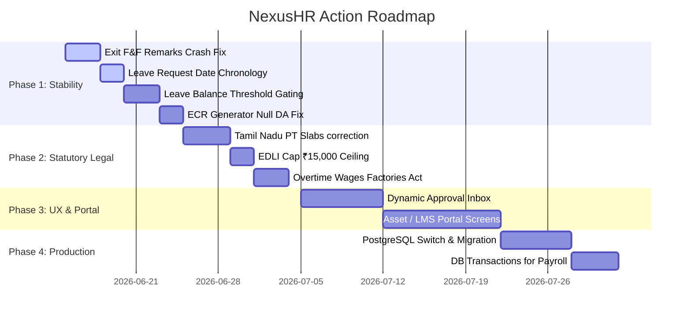

# 06. Post-Audit Implementation Plan and Roadmap

## 1. Readiness Assessment

Following a static code audit of the NexusHR system, the application is highly functional but presents critical bugs that prevent immediate enterprise deployment. In particular, statutory calculations (EPF, ESI, Gratuity, Professional Tax) require adjustment to comply with Indian labor laws, and several transaction-heavy modules (Exit F&F, Leave applications) contain logic failures that trigger server crashes or data corruption.

---

## 2. Four-Phase Action Roadmap

### Phase 1: Stabilization & Core Fixes (Immediate)
*   **Goal:** Eliminate application crashes and data integrity issues.
*   **Key Work:**
    1.  Fix the database mismatch in the F&F termination flow (add `remarks` to the `ExitDetails` Prisma model).
    2.  Add validators checking that `endDate >= startDate` in leave applications to prevent negative leaves.
    3.  Gate leave creation to block requests that exceed active leave quotas.
    4.  Resolve the ECR text-challan generator crash by handling null/zero Dearness Allowance (DA) values.

### Phase 2: Statutory Compliance & India Legal (Required for Go-Live)
*   **Goal:** Align calculations with statutory rules.
*   **Key Work:**
    1.  Re-code Tamil Nadu Professional Tax deductions to accumulate slabs semi-annually rather than monthly.
    2.  Cap EPFO EDLI calculation earnings at ₹15,000 instead of calculating against unlimited basic wages.
    3.  Compute Overtime pay using double the rate of ordinary wages (Basic + Allowance) instead of Basic only.

### Phase 3: UX & Workflows Improvements
*   **Goal:** Enhance usability and complete under-implemented features.
*   **Key Work:**
    1.  Build a unified Manager Inbox drawer containing all pending team approvals.
    2.  Implement frontend screens and tables for Assets, Helpdesk ticketing, and Learning Catalogs.
    3.  Introduce input masks for PAN, Aadhar, and UAN fields.

### Phase 4: Production Security & Performance
*   **Goal:** Secure infrastructure and prepare for high employee counts.
*   **Key Work:**
    1.  Transition the database from SQLite to PostgreSQL.
    2.  Wrap payroll calculation loops in Prisma database transactions (`prisma.$transaction`) to prevent half-finished payroll states.
    3.  Implement composite indexing on transactional logs.

---

## 3. Backlog Tasks Register

| Task ID | Task Name | Component | Priority | Effort (Points) | Description | Target File |
| --- | --- | --- | --- | --- | --- | --- |
| **TSK-STB-001** | Exit Remarks Mismatch Fix | Backend DB | Critical | 2 | Add `remarks` string to `ExitDetails` Prisma schema model. | [`schema.prisma`](file:///e:/HRMS_application/backend/prisma/schema.prisma) |
| **TSK-STB-002** | Chronology Check Leave | Backend API | Critical | 3 | Add validator in `leaveController.js` rejecting requests where `endDate < startDate`. | [`leaveController.js`](file:///e:/HRMS_application/backend/src/controllers/leaveController.js) |
| **TSK-STB-003** | Leave Balance Checker | Backend API | Critical | 5 | Add guard checking employee's leave balance before approving requests. | [`leaveController.js`](file:///e:/HRMS_application/backend/src/controllers/leaveController.js) |
| **TSK-LEG-001** | Tamil Nadu PT Ceiling | Salary Service| High | 5 | Change PT slabs in Tamil Nadu to accrue semi-annually (September/March). | [`salaryService.js`](file:///e:/HRMS_application/backend/src/services/salaryService.js) |
| **TSK-LEG-002** | EDLI Statutory Cap | Salary Service| High | 3 | Insert a statutory cap of ₹15,000 basic wage on EDLI calculations. | [`salaryService.js`](file:///e:/HRMS_application/backend/src/services/salaryService.js) |
| **TSK-LEG-003** | Overtime Ordinary Wage | Overtime API | High | 5 | Recalculate overtime using (Basic + DA + fixed allowances) * 2. | [`overtimeController.js`](file:///e:/HRMS_application/backend/src/controllers/overtimeController.js) |
| **TSK-INF-001** | PostgreSQL DB Setup | Infrastructure| Medium | 8 | Configure production database config and migrate SQLite schema. | `docker-compose.yml`, `.env` |
| **TSK-INF-002** | Payroll Transaction Wrap | Salary Service| Medium | 8 | Wrap bulk payroll records calculation in atomic SQL transactions. | [`payrollController.js`](file:///e:/HRMS_application/backend/src/controllers/payrollController.js) |

---

## 4. Test Cases Outline

### TC-LEAVE-001: Out-of-Order Dates Gating
*   **Scenario:** Attempting to submit a leave request with an invalid date sequence.
*   **Steps:**
    1.  Log in as employee.
    2.  Navigate to `/leave` console.
    3.  Select Start Date as `2026-06-20`, End Date as `2026-06-15`.
    4.  Click Submit.
*   **Expected Result:** Request is rejected with a clear "End Date must be after Start Date" warning. No database entry is created.

### TC-PAY-001: EDLI Statutory Cap check
*   **Scenario:** Verifying EDLI calculation does not exceed statutory caps.
*   **Steps:**
    1.  Select an employee with Basic Salary of ₹45,000.
    2.  Process payroll for this employee.
    3.  Inspect the generated `pfEmployer` / EDLI contribution in the payroll record.
*   **Expected Result:** EDLI employer contribution is computed on ₹15,000 cap (resulting in exactly ₹75 under 0.5% rate) instead of ₹45,000 (which would yield an incorrect ₹225).

---

## 5. Production Deployment Checklists

### Pre-Deployment Verification
*   [ ] Compile and build frontend without type failures: `npm run build` inside `frontend/`.
*   [ ] Run Jest test suites successfully: `npm test` inside `backend/`.
*   [ ] Verify Prisma schemas match the target environment: `npx prisma db validate`.
*   [ ] Sync new database migration schema variables: `npx prisma migrate deploy`.

### Go-Live Verification
*   [ ] Check that `.env` configures `DATABASE_URL` pointing to PostgreSQL rather than local SQLite file.
*   [ ] Confirm `JWT_SECRET` has been rotated to a strong, high-entropy cryptographic sequence.
*   [ ] Verify the mail server variables (`SMTP_HOST`, `SMTP_PORT`, `SMTP_USER`) respond to check health actions.
*   [ ] Verify that the server's local clock is set to `Asia/Kolkata` timezone to ensure correct punch calculations.
