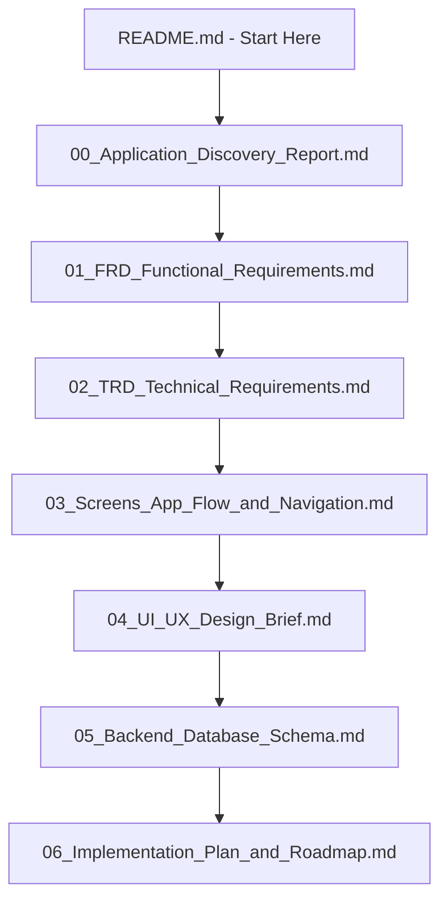

# PID hcms documentation Hub — Master Index & Glossary

Welcome to the **PID hcms** documentation package. This repository contains structured documentation detailing the application discovery results, functional requirements, technical specifications, client navigation assets, visual design guidelines, database dictionary, and the post-audit action roadmap.

---

## 1. Documentation Index & Recommended Reading Path

We recommend stakeholders and developers explore the files in the following sequence:

1.  **[00. Application Discovery Report](file:///e:/HRMS_application/docs/00_Application_Discovery_Report.md):** High-level summary of the system, detected tech stack, directory layouts, and immediate audit matrix findings.
2.  **[01. Functional Requirements Document (FRD)](file:///e:/HRMS_application/docs/01_FRD_Functional_Requirements.md):** Persona matrices, dynamic RBAC permission rules, detailed functional scopes, validation requirements, and requirements traceability matrix.
3.  **[02. Technical Requirements Document (TRD)](file:///e:/HRMS_application/docs/02_TRD_Technical_Requirements.md):** 3-tier logical architecture, JWT & MFA verification sequence flows, API request lifecycle, and modular API tables.
4.  **[03. Screens, App Flow, and Navigation Map](file:///e:/HRMS_application/docs/03_Screens_App_Flow_and_Navigation.md):** Client-side pages directory, related forms, user flow charts, and sidebar navigation hierarchy.
5.  **[04. UI/UX Design Brief](file:///e:/HRMS_application/docs/04_UI_UX_Design_Brief.md):** Layout behaviors, dark-mode CSS design tokens, components inventory, UX reviews, and design briefs for a future premium version.
6.  **[05. Backend Database Schema](file:///e:/HRMS_application/docs/05_Backend_Database_Schema.md):** Dynamic Entity Relationship Diagram (ERD), full data dictionary tables, and database recommendations.
7.  **[06. Post-Audit Implementation Plan and Roadmap](file:///e:/HRMS_application/docs/06_Implementation_Plan_and_Roadmap.md):** Release readiness, 4-phase backlog roadmap, test cases outline, and production deployment checklists.

---

## 2. Maintenance and Documentation Update Policies

To ensure these documents remain accurate as the codebase evolves:
1.  **Prisma Schema updates:** If models or fields are added to `schema.prisma`, update the ERD and Dictionary in `05_Backend_Database_Schema.md`.
2.  **API Modifications:** If backend endpoints or Zod validation schemas are adjusted, update the endpoints catalog in `02_TRD_Technical_Requirements.md`.
3.  **Visual Overhauls:** If the global design stylesheet `globals.css` colors or variables change, update the visual tokens inside `04_UI_UX_Design_Brief.md`.

---

## 3. Comprehensive HRMS & Compliance Glossary

### Business Terms
*   **ESS (Employee Self-Service):** A dashboard view allowing employees to submit leaves, log tasks, track timesheets, submit expense receipts, and download payslips.
*   **MSS (Manager Self-Service):** Features scoped for line managers to view team sheets, schedule shifts, and approve/reject leave/expense requests.
*   **Maker-Checker Workflow:** A security best practice dividing transactions into two steps: one user creates the draft (Maker) and a separate user signs off/authorizes it (Checker). Used in payroll runs (Admin -> Reviewer -> Approver).
*   **LOP (Loss of Pay):** Salary deduction applied to an employee for unapproved absences or unpaid leaves.

### Indian Statutory Terms
*   **EPF (Employee Provident Fund):** A statutory retirement scheme in India. Employee and employer contribute 12% of basic wages. Contributed amounts are filed monthly via ECR challans.
*   **EDLI (Employees' Deposit Linked Insurance Scheme):** Life insurance coverage provided by the EPFO. Employers contribute 0.5% of basic salary, capped at ₹15,000 basic earnings.
*   **ESIC (Employees' State Insurance Corporation):** Statutory health insurance for employees earning ₹21,000/month or less. Employer contributes 3.25%; employee contributes 0.75% of gross wages.
*   **Professional Tax (PT):** State-level tax levied on employment income. Subject to state-specific slabs and a constitutional annual ceiling of ₹2,500.
*   **LWF (Labor Welfare Fund):** Statutory fund managed by state boards to support low-wage workers. Deductions occur semi-annually or annually based on state boards.
*   **Gratuity:** Statutory payment paid to employees completing 5 or more years of continuous service. Calculated as `(Basic + DA) * 15 / 26 * Years of Service`.
*   **TDS (Tax Deducted at Source):** Monthly income tax withholding based on income projections, tax slabs (Old vs New Regimes), and Section 80C/80D investments.
*   **Form 16:** A certificate issued annually by employers detailing salary paid and tax withheld (TDS).
*   **F&F (Full and Final Settlement):** The final settlement calculation (encashments, gratuity, notice period recoveries, expense balances) given to an employee upon resignation or exit.

### Technical Terms
*   **Prisma Client / ORM:** An object-relational mapping tool that allows writing TypeScript/JavaScript queries instead of raw SQL.
*   **Zod Schema:** A TypeScript-first schema declaration and validation library, used to validate Express API requests at runtime.
*   **JWT (JSON Web Token):** A secure, URL-safe string containing a signed JSON payload, used to authenticate stateless user requests.
*   **MFA (Multi-Factor Authentication):** A security process where users verify their identity using a dynamic 6-digit passcode generated by an authenticator application (using TOTP algorithms).
