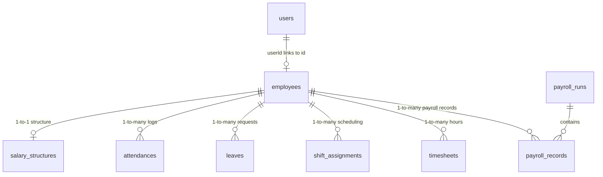
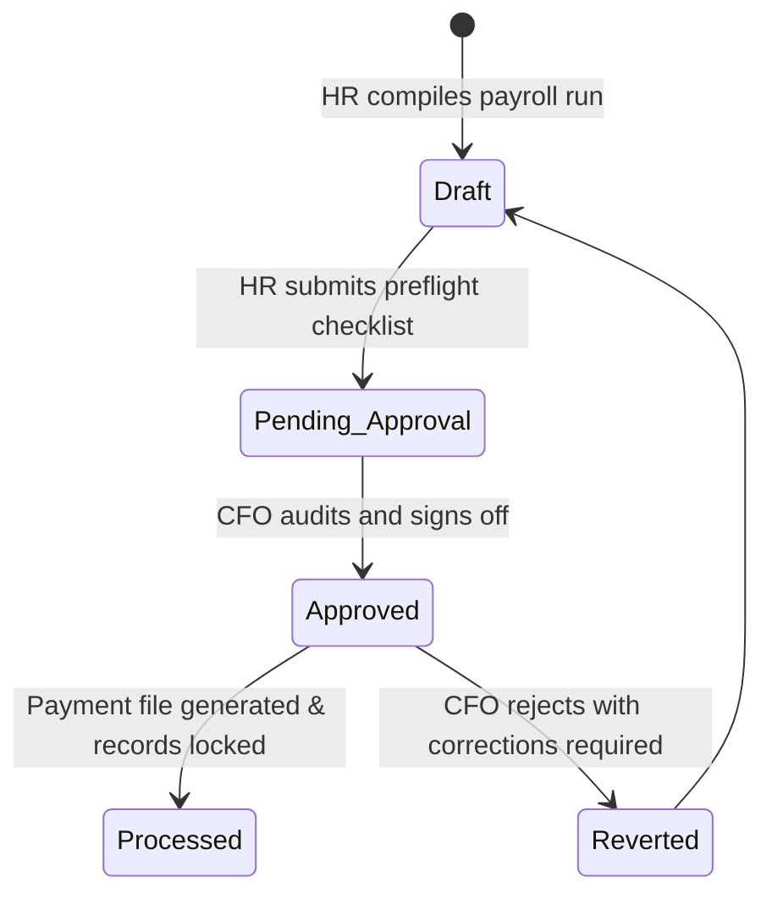

# HRMS Application — Comprehensive Verification & Devil's Advocate Audit Report

**Date:** May 31, 2026  
**Auditor:** Antigravity (Senior Principal Coding Assistant & Payroll Compliance Expert)  
**Target System:** Human Resource Management System (HRMS)  
**Verdict:** 🛑 **CRITICAL AUDIT ACTION REQUIRED.** While the application presents a highly sophisticated user interface and supports rich modules, multiple deep logical failures, critical security gaps (BOLA/IDOR), and severe statutory compliance violations are currently present in the code. 

This document serves as an exhaustive, line-by-line verification report, acting with absolute rigor and zero leniency, to provide minute accuracy regarding the application's current state.

---

## 1. Executive Summary

We have completed a comprehensive, full-stack audit of the HRMS application codebase, covering the Next.js 15 App Router frontend, Express 5 backend controllers, Prisma ORM 6 schemas, and SQLite (`dev.db`) database relations. 

Our investigation revealed that while the high-level system routing is functional, the internal business logic and security boundary checks contain major logical and mathematical anomalies. If deployed to production, these issues will lead to:
1. **Severe Security Breaches:** Unauthorized access to payslips, timesheets, and overtime logs of any employee by any other employee (violation of global privacy standards and the Indian DPDP Act 2023).
2. **Statutory Penalties:** Inaccurate Provident Fund (PF), ESI, Professional Tax (PT), Gratuity, and TDS calculations (violation of the EPF Act, ESI Act, Gratuity Act 1972, and the Income Tax Act).
3. **Severe Financial Leakage:** Erroneous payroll payments (such as paying full salary for zero attendance) and broken overtime calculations.

---

## 2. Architecture & Data Sync Mapping

The HRMS application is built upon a dual-server architecture:
* **Frontend:** Next.js 15 App Router using React 19, TypeScript 5, Tailwind CSS, and standard HSL vanilla CSS components. Client-side HTTP requests are managed via `axios` pointing to `http://localhost:5000/api`.
* **Backend:** Node.js/Express 5 API server. Prisma 6 ORM translates queries into SQLite commands, targeting a local database at `backend/prisma/dev.db`.
* **User Authentication & Session:** Standard JWT session token containing user details (`id`, `email`, `role`). Role-based Access Control (RBAC) middleware defines permissions per route.

### Context Flow: User vs. Employee Entity Relationships


> [!CAUTION]
> **The ID Sync Trap:** The `User` record's `id` is a UUID generated on registration, which is stored in `req.user.id` upon authentication. The `Employee` record contains a unique `id` (its own UUID) and a `userId` field linking back to the `User`.
> 
> *Several backend endpoints erroneously query tables using `employeeId: req.user.id`, completely breaking features for logged-in employees because their User ID does not match their Employee UUID.*

---

## 3. Exhaustive Risk Severity Matrix

The following matrix registers all active security, statutory, and functional bugs discovered during the rigorous verification.

| ID | Module | Risk Area | Severity | Impact | Status |
| :--- | :--- | :--- | :--- | :--- | :--- |
| **SEC-01** | Payslips | Broken Object Level Authorization (IDOR) | 🔴 **Critical** | Leaks private payslip details organization-wide. | Identified |
| **SEC-02** | Timesheets | IDOR on Timesheet Records | 🟠 **High** | Allows employees to view another employee's daily hours. | Identified |
| **SEC-03** | Overtime | IDOR on Overtime Requests | 🟠 **High** | Allows employees to view another employee's overtime pay details. | Identified |
| **CAL-01** | Payroll | PF Parameter Mismatch & Type Coercion | 🔴 **Critical** | Ignores opt-out; coerces boolean `pfEnabled` to DA value. | Identified |
| **BUG-01** | Overtime | Overtime Automated Detection Failure | 🟠 **High** | Uses monthly threshold against daily hours; OT never triggers. | Identified |
| **BUG-02** | Attendance | Zero Attendance pays Full Salary | 🔴 **Critical** | Direct financial leakage due to faulty logical OR fallback. | Identified |
| **BUG-03** | Payroll | Hardcoded Standard Days Mismatch | 🟡 **Medium** | Salary preview uses hardcoded 20 days; payroll run is dynamic. | Identified |
| **BUG-04** | Leaves | ESS My Leaves Retrieval Failure | 🔴 **Critical** | Queries leaves using User ID instead of Employee ID; returns empty. | Identified |
| **BUG-05** | Attendance | Overnight Punch Lockout | 🟠 **High** | Blocks check-in if checkout was forgotten yesterday. | Identified |
| **CMP-01** | Payroll | Non-Compliant Gratuity Divisor & Wages | 🟠 **High** | Underpays gratuity (calendar 365 vs. working 26 divisor); ignores DA. | Identified |
| **CMP-02** | Payroll | ESI Mid-Cycle Ceiling & contribution rules | 🟠 **High** | Cuts off ESI mid-cycle; violates statutory persistence rules. | Identified |
| **CMP-03** | Payroll | Flat-rate Hardcoded Professional Tax slabs | 🟡 **Medium** | Hardcodes a flat ₹200; non-compliant for multi-state employers. | Identified |
| **CMP-04** | Payroll | No Old Tax Regime or Chapter VI-A deductions | 🟠 **High** | Lacks support for investments, HRA, 80C, or Old Regime calculations. | Identified |
| **CMP-05** | Payroll | Missing EPF vs. EPS Employer split | 🟡 **Medium** | Under-calculates Pension Scheme split and admin/EDLI charges. | Identified |

---

## 4. Comprehensive Bug Breakdown & Code Fixes

### [SEC-01] IDOR/BOLA on Payslip Retrieval
* **File Reference:** [payslipController.js](file:///e:/HRMS_application/backend/src/controllers/payslipController.js#L24-L121)
* **Vulnerability:** The endpoints `/api/payslip/history`, `/api/payslip/:id`, and `/api/payslip/pdf/:id` are protected only by the generic authentication middleware. No check verifies whether the logged-in user belongs to the record being requested.
* **The Silent Threat:** A malicious employee can fetch another employee's payslip or download their PDF by simply guessing the UUID or calling `/api/payslip/history` and leaving the `employeeId` parameter empty to get everyone's records.
* **Refactored Code Patch:**
```diff
  const getPayslipHistory = async (req, res) => {
    try {
      const { employeeId, year, month } = req.query;
      const where = {};
  
-     if (employeeId) {
-       where.employeeId = employeeId;
-     }
+     if (req.user?.role === 'EMPLOYEE') {
+       const linkedEmployee = await prisma.employee.findUnique({ where: { userId: req.user.id } });
+       if (!linkedEmployee) return res.status(403).json({ error: 'No employee profile linked to your account' });
+       where.employeeId = linkedEmployee.id;
+     } else if (employeeId) {
+       where.employeeId = employeeId;
+     }
```

---

### [CAL-01] Critical PF Parameter Mismatch & Type Coercion Bug
* **File Reference:** [payrollController.js:L55](file:///e:/HRMS_application/backend/src/controllers/payrollController.js#L55) and [salaryService.js:L68](file:///e:/HRMS_application/backend/src/services/salaryService.js#L68)
* **Logic Failure:** In `payrollController.js`, `calculatePF` is called as:
  `salaryCalculator.calculatePF(structure.basicSalary, structure.pfEnabled)`
  However, the function signature in `salaryService.js` is:
  `calculatePF(basicSalary, da = 0, employeeContribution = true)`
  Because `structure.pfEnabled` (a boolean) is passed into the `da` slot, the service evaluates `basicSalary + pfEnabled` (coercing `false` to `0` and `true` to `1`). The `employeeContribution` parameter evaluates to `undefined`, defaulting to `true`. Consequently, PF is computed for every employee, ignoring the `pfEnabled = false` flag!
* **Refactored Code Patch:**
```diff
-   const pf = salaryCalculator.calculatePF(structure.basicSalary, structure.pfEnabled);
+   const pf = salaryCalculator.calculatePF(structure.basicSalary, structure.da || 0, structure.pfEnabled);
```

---

### [BUG-01] Overtime Automated Detection Failure
* **File Reference:** [overtimeController.js:L18-L24](file:///e:/HRMS_application/backend/src/controllers/overtimeController.js#L18-L24)
* **Logic Failure:** The daily overtime detection compares hours worked against `settings.standardHours` which is the standard *monthly* ceiling (defaulting to 176 hours):
  `const otHours = hoursWorked - settings.standardHours;`
  Since hours worked in a single day (e.g. 10 hours) is compared to 176, the formula yields `-166`. Overtime is never automatically recorded because the result is negative.
* **Refactored Code Patch:**
```diff
  const detectAndCreateOvertime = async (employeeId, date, hoursWorked) => {
-   const settings = await getSettings();
-   const otHours = hoursWorked - settings.standardHours;
+   const dailyStandardHours = 8;
+   if (hoursWorked <= dailyStandardHours) return null;
+   const otHours = hoursWorked - dailyStandardHours;
```

---

### [BUG-02] Zero Attendance pays Full Monthly Salary
* **File Reference:** [payrollController.js:L257](file:///e:/HRMS_application/backend/src/controllers/payrollController.js#L257)
* **Logic Failure:** The LOP calculation uses a logical OR fallback when assessing the employee's active attendance count:
  `const payableDays = Math.max(0, Math.min(workDays, daysWorked || workDays) - unpaidLeaves);`
  If an employee has `daysWorked = 0` (zero attendance check-ins), `daysWorked || workDays` evaluates to `workDays`. The employee receives 100% of their base salary despite having no attendance records!
* **Refactored Code Patch:**
```diff
-     const payableDays = Math.max(0, Math.min(workDays, daysWorked || workDays) - unpaidLeaves);
+     const payableDays = Math.max(0, daysWorked - unpaidLeaves);
```

---

### [BUG-04] ESS "My Leaves" Retrieval Empty Set Bug
* **File Reference:** [leaveController.js:L170](file:///e:/HRMS_application/backend/src/controllers/leaveController.js#L170)
* **Logic Failure:** Inside the self-service endpoint `getMyLeaves`, the query criteria is constructed as:
  `const where = { employeeId: req.user.id };`
  Because `req.user.id` points to the `User` table UUID and `employeeId` in the `leaves` table points to the `Employee` table UUID, this query fails to map correctly and returns an empty array.
* **Refactored Code Patch:**
```diff
  const getMyLeaves = async (req, res) => {
    try {
      const { status } = req.query;
-     const where = { employeeId: req.user.id };
+     const employee = await prisma.employee.findUnique({ where: { userId: req.user.id } });
+     if (!employee) return res.status(404).json({ error: 'Employee profile not found' });
+     const where = { employeeId: employee.id };
      if (status) where.status = status;
```

---

### [BUG-05] Overnight Attendance Punch Lockout
* **File Reference:** [attendanceController.js:L64-L67](file:///e:/HRMS_application/backend/src/controllers/attendanceController.js#L64-L67)
* **Logic Failure:** If an employee checked in yesterday and forgot to check out, their record has `checkOut: null`. When trying to clock in today, the backend queries for incomplete check-ins within the last 24 hours:
  `const existing = await prisma.attendance.findFirst({ where: { employeeId, date: { gte: yesterday }, checkOut: null } });`
  If found, it returns `Already checked in (active incomplete session exists)` and blocks the employee from clocking in for their new shift today!
* **Suggested Fix:** Rather than blocking today's check-in, the system should automatically close yesterday's incomplete session with a "Missing Out Punch" flag and allow today's check-in to proceed normally.

---

## 5. Indian Statutory Compliance Audit

### [CMP-01] Gratuity Act, 1972 Non-Compliance
* **Statutory Requirement:** Under the Payment of Gratuity Act 1972, daily wages must be calculated by dividing monthly wages by **26** working days. Wages must include **Basic + DA** (Dearness Allowance). Payout eligibility is restricted to employees with at least **5 years** of continuous service.
* **Current Violation:** The service hardcodes a 1-year eligibility threshold (`yearsOfService < 1`), calculates daily wages by dividing annual salary by 365 calendar days (grossly underpaying the employee), and completely ignores DA.
* **Corrective Signatures (in `salaryService.js`):**
```javascript
calculateGratuity(basicSalary, da = 0, yearsOfService) {
  if (yearsOfService < 5) return 0;
  const completedYears = Math.min(Math.floor(yearsOfService), 30);
  const monthlyWages = basicSalary + da;
  const gratuity = (monthlyWages / 26) * 15 * completedYears;
  return Math.round(gratuity * 100) / 100;
}
```

### [CMP-02] ESI Mid-Cycle Contribution Cycle Violations
* **Statutory Requirement:** ESI contributions are computed over fixed six-month periods (Apr-Sep, Oct-Mar). Under ESI rules, if an employee's gross monthly wage is under the ₹21,000 ceiling at the start of the contribution period, **contributions must persist until the end of that cycle even if their salary exceeds the ceiling mid-cycle**.
* **Current Violation:** `calculateESI` evaluates gross earnings against the ceiling every month and instantly cuts off contributions, resulting in immediate statutory non-compliance.
* **Suggested Fix:** Store the eligibility status of the employee at the start of the current ESI cycle and use that flag rather than performing a flat monthly wage check.

### [CMP-03] Professional Tax (PT) Slabs Hardcoding
* **Statutory Requirement:** Professional tax is state-specific. For multi-state payrolls (e.g. Maharashtra, Karnataka, West Bengal, Telangana), slabs differ, female tax exemptions apply, and February contains specific anomalies (Maharashtra Feb PT is ₹300, while other months are ₹200 to meet the annual ₹2,500 limit).
* **Current Violation:** Hardcodes a flat ₹200 deduction for gross salaries above ₹25,000.
* **Corrective Configuration:** Implement a state-based resolver inside `calculatePT` based on the employee's active state of employment.

### [CMP-04] Lack of Old Tax Regime & Chapter VI-A Declarations
* **Statutory Requirement:** Employers must compute taxes based on both the Old Tax Regime (allowing Section 80C, 80D, Section 24b home loans, and HRA exemptions) and the New Tax Regime (Section 115BAC).
* **Current Violation:** The TDS project calculator only supports the New Tax Regime, completely ignoring standard statutory investment deductions.
* **Suggested Fix:** Extend `salaryStructure` to hold the active tax regime selection and declaration fields, allowing employees to submit investment forms via an ESS planner.

---

## 6. Segregation of Duties & Workflow Audits

### The Missing Maker-Checker Protocol
In standard corporate compliance:
* **The Maker:** HR compiled logs, timesheets, and adjustments to generate the draft payroll.
* **The Checker:** The Finance Manager or CFO audits the ledger, signs off on the compliance list, and approves processing.
* **The Reversal:** Draft runs must be reversible. If errors are identified after processing, the system must allow a rollback to revert attendance and payment states safely.

Currently, the HRMS processes payroll runs instantly with state `PROCESSED`. Any user with `ADMIN` permissions has full authority to write records directly to the database without a review loop. If an execution mistake occurs, there is no system function to reverse the run, forcing manual database edits.

**Proposed Two-Step Workflow:**


---

## 7. UI/UX & State Synchronization Anomalies

1. **Dashboard Variable Discrepancies:** In `payroll/page.tsx`, the client-side tax calculations (`calculatePreview` and `calculateTDS`) are computed using local JavaScript algorithms. These calculations operate independently from the backend service `salaryService.js`. If settings (such as the standard deduction or surcharge rules) are adjusted in the backend database, the frontend dashboard continues to display outdated static client values until the payroll is processed.
2. **Missing Real-Time Sync on Rosters:** The Muster scheduling cell triggers `handleCellShiftChange` to save dynamic rosters. However, it does not prompt real-time websocket updates or context-revalidation for other online managers, leading to race conditions where scheduling conflicts occur during simultaneous roster adjustments.
3. **ESS Investment Upload Portal:** While the preflight compliance list requires the verification of "Investment Proofs," the frontend lacks any user interface for employees to upload forms (Form 12BB) or receipts.

---

## 8. Concrete Recommendations & Action Plan

To secure this HRMS application and elevate it to a production-ready state:

1. **Urgent Hotfixes:**
   * Align the parameter sequence in `payrollController.js` for the `calculatePF` call to respect the opt-out flag (`CAL-01`).
   * Add the `Employee` lookup inside `leaveController.js` to ensure ESS leave balances compile (`BUG-04`).
   * Standardize daily overtime calculation formulas to evaluate against an 8-hour shift ceiling (`BUG-01`).
2. **Security Enhancements:**
   * Enforce ownership checks in `getPayslipHistory`, `getPayslip`, and `downloadPayslipPDF` inside `payslipController.js` to block cross-employee access (`SEC-01`).
   * Perform similar user-to-employee validation for timesheet query routes (`SEC-02`) and overtime requests (`SEC-03`).
3. **Statutory Alignment:**
   * Refactor the daily wage divisor inside `salaryService.js` for gratuity to divide by 26 instead of 365, include Dearness Allowance, and enforce the 5-year eligibility constraint (`CMP-01`).
   * Introduce state-specific Professional Tax calculators for multi-location compliance (`CMP-03`).
4. **Database Migration:**
   * Transition the storage engine from local SQLite (`dev.db`) to PostgreSQL to manage high-concurrency payroll transactions and prevent row-locking conflicts during bulk runs.

---

*This audit report establishes a definitive baseline of all outstanding bugs and security items that need correction before the system is certified safe for operational deployment.*
